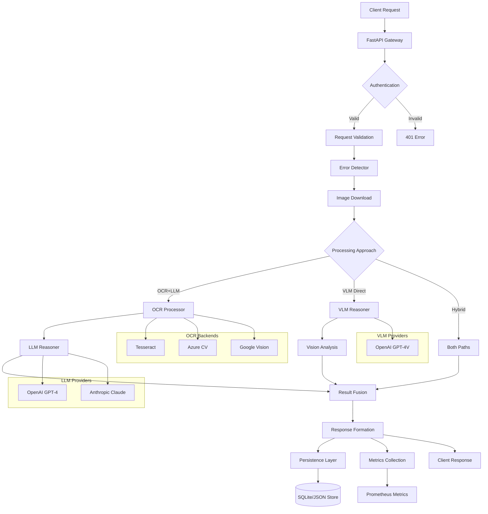

# Error Detection API - System Architecture

## Overview

The Error Detection API is designed as a scalable, reliable system for analyzing handwritten mathematical solutions and providing step-level error detection with educational feedback.

## Architecture Diagram



## Components & Data Flow

### 1. API Gateway Layer
- **FastAPI Application**: Handles HTTP routing, middleware, CORS
- **Authentication**: API key validation with constant-time comparison
- **Request Validation**: Pydantic schema validation for type safety
- **Rate Limiting**: Middleware for request throttling (optional)

### 2. Processing Pipeline

#### Image Processing
1. **Image Download**: Concurrent fetching of question/solution images
2. **Validation**: Size limits, format checking
3. **Preprocessing**: Resizing, bounding box application

#### Error Detection Approaches
- **OCR + LLM**: Extract text via OCR, analyze with language model
- **VLM Direct**: Direct vision-language model analysis
- **Hybrid**: Combine both approaches for best accuracy

#### Analysis Flow
1. **Text Extraction** (OCR path): Multiple backend support with fallbacks
2. **Reasoning**: Mathematical error analysis using LLMs/VLMs
3. **Result Fusion** (Hybrid): Intelligent combination of results

### 3. Persistence & Observability
- **Request/Response Storage**: SQLite for development, configurable backends
- **Structured Logging**: Request tracking, error logging
- **Metrics**: Prometheus-compatible metrics for monitoring

## Request Lifecycle

### Normal Flow
```
Client Request → Auth → Validation → Processing → Response → Audit
    ↓
Request ID assigned, logging starts
    ↓
Concurrent image downloads (with timeout)
    ↓
Error detection processing (with timeout)
    ↓
Response formatting and metrics collection
    ↓
Background persistence and cleanup
```

### Error Handling
- **Graceful Degradation**: Return partial results when possible
- **Timeout Management**: 30s request timeout with early termination
- **Retry Logic**: Built into OCR backends with exponential backoff
- **Circuit Breakers**: Fail fast on repeated external service failures

## Concurrency & Performance

### Concurrency Controls
- **Semaphore-based limiting**: Max 10 concurrent requests (configurable)
- **Async processing**: Non-blocking I/O throughout the pipeline
- **Background tasks**: Persistence operations don't block responses

### Performance Optimizations
- **Image caching**: Optional Redis caching for repeated images
- **Model caching**: Persistent connections to LLM providers
- **Batch processing**: Group similar requests when possible

## Scalability Considerations

### Horizontal Scaling
- **Stateless Design**: No server-side session state
- **Load Balancer Ready**: Health checks and graceful shutdown
- **Database Scaling**: Easy migration from SQLite to PostgreSQL/MySQL

### Vertical Scaling
- **Resource Limits**: Configurable memory and CPU limits
- **Connection Pooling**: Efficient use of external API connections
- **Background Processing**: Separate worker processes for heavy tasks

### Caching Strategy
```
Level 1: In-memory LRU cache (request results)
Level 2: Redis cache (image processing results)
Level 3: Database cache (historical results)
```

## Reliability & Security

### Failure Modes & Handling
- **Network Failures**: Retry with exponential backoff
- **Model API Failures**: Graceful fallback to simpler approaches
- **Image Processing Failures**: Return diagnostic information
- **Database Failures**: Fall back to JSON file storage

### Security Measures
- **API Key Authentication**: Required for all endpoints
- **Request Sanitization**: Strict input validation
- **Rate Limiting**: Prevent abuse and DoS attacks
- **HTTPS Only**: TLS encryption in production
- **PII Handling**: User ID hashing for privacy

### Circuit Breaker Pattern
```python
External Service → Circuit Breaker → Fallback Strategy
    ↓
- Closed: Normal operation
- Open: Fail fast after repeated failures
- Half-Open: Test recovery
```

## Performance & Cost Controls

### Token/Vision Budget Management
- **Request Quotas**: Per-user and global limits
- **Model Selection**: Automatic downgrade under high load
- **Prompt Optimization**: Efficient prompt engineering
- **Image Downscaling**: Reduce processing costs

### Cost Monitoring
- **Real-time Tracking**: Token usage and API costs
- **Budget Alerts**: Automatic notifications on threshold breach
- **Usage Analytics**: Per-user cost attribution

## Technology Trade-offs

### 1. Database Choice: SQLite vs PostgreSQL
**Chose SQLite for MVP:**
- ✅ Zero configuration setup
- ✅ Perfect for development and small deployments
- ✅ ACID compliance and reliability
- ❌ Limited concurrent writes
- ❌ No advanced features (JSON queries, etc.)

**Migration Path:** Easy transition to PostgreSQL using SQLAlchemy ORM

### 2. Processing Approach: OCR+LLM vs VLM vs Hybrid
**Chose Hybrid:**
- ✅ Best accuracy by combining approaches
- ✅ Fallback options if one method fails
- ✅ Can optimize cost/performance per request
- ❌ Higher latency and cost
- ❌ More complex system

### 3. Async vs Sync: FastAPI vs Flask
**Chose FastAPI:**
- ✅ Native async support for better concurrency
- ✅ Automatic API documentation
- ✅ Built-in request validation
- ✅ Type hints throughout
- ❌ Slightly higher learning curve

### 4. Storage: Files vs Database vs Cloud
**Chose Hybrid Approach:**
- Development: SQLite + JSON files
- Production: PostgreSQL + S3/GCS
- ✅ Flexible deployment options
- ✅ Cost-effective scaling path
- ❌ Additional complexity

## Monitoring & Observability

### Key Metrics
- Request rate, latency percentiles (p50/p90/p95)
- Error rates by type and endpoint
- Model usage and costs
- Concurrent request levels

### Alerting Thresholds
- p95 latency > 10s
- Error rate > 5%
- Concurrent requests > 90% of limit
- Model API failures > 10%

### Health Checks
- `/health`: Basic service health
- `/metrics`: Prometheus metrics
- Deep health checks: Database, external APIs

This architecture provides a solid foundation for the Error Detection API with clear scaling paths and robust error handling.