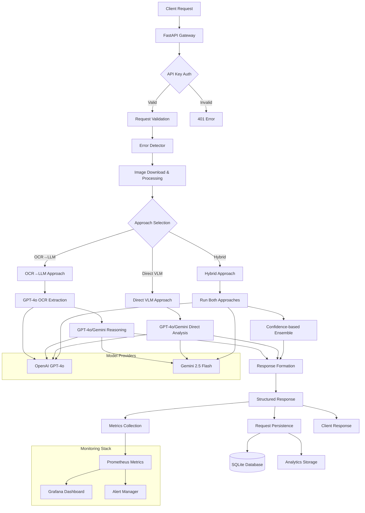

# Error Detection API - System Architecture

## Overview

The Error Detection API is a production-ready system implementing three distinct error detection approaches for educational math solutions. Built with FastAPI, it supports concurrent processing, comprehensive monitoring, and cost-effective scaling.

## Architecture Diagram



## Current Implementation Details

### 1. API Layer (`src/api/`)
- **FastAPI Application** with async request handling
- **Middleware Stack**: CORS, Security, Logging, Metrics
- **Authentication**: Bearer token validation with constant-time comparison
- **Request/Response Schemas**: Pydantic models with comprehensive validation
- **Health Endpoints**: `/health` and `/metrics` for monitoring

### 2. Three Error Detection Approaches (`src/models/`)

#### OCR→LLM Approach
- **Step 1**: GPT-4o vision model extracts text from images
- **Step 2**: GPT-4o or Gemini analyzes extracted text for errors
- **Benefits**: Precise text extraction, structured reasoning
- **Cost**: $0.011 per request (2 API calls)

#### Direct VLM Approach
- **Single Call**: GPT-4o or Gemini analyzes images directly
- **Benefits**: Fast processing, handles visual/spatial elements
- **Cost**: $0.009 per request (1 API call)

#### Hybrid Approach
- **Multi-path**: Runs both OCR→LLM and Direct VLM concurrently
- **Ensemble**: Confidence-based result combination
- **Benefits**: Highest accuracy, fault tolerance
- **Cost**: $0.020 per request (3 API calls)

### 3. Model Router & Provider System (`src/models/model_router.py`)
- **Multi-provider Support**: OpenAI GPT-4o and Gemini 2.5 Flash
- **Automatic Fallbacks**: Provider failures handled gracefully
- **Structured Outputs**: Pydantic schema enforcement across providers
- **Token Tracking**: Comprehensive cost calculation and monitoring

### 4. Monitoring & Observability (`src/utils/`)

#### Prometheus Metrics (`src/utils/metrics.py`)
- HTTP request metrics (rate, latency, errors)
- Error detection specific metrics (approach usage, accuracy)
- Cost tracking and token usage
- Concurrent request monitoring

#### API Tracker (`src/utils/api_tracker.py`)
- Real-time API call monitoring
- Cost calculation per request
- Session-based tracking
- Performance analytics

#### Analytics Storage (`src/analytics/`)
- Historical data storage and analysis
- Performance trend tracking
- Cost optimization insights
- Usage pattern analysis

### 5. Configuration Management (`src/config/settings.py`)
- Environment-based configuration
- Model provider selection (OpenAI/Gemini/Auto)
- Approach selection (OCR→LLM/Direct VLM/Hybrid)
- Performance tuning parameters

## Request Processing Flow

### 1. Request Lifecycle
```
1. Client Request → API Key Validation
2. Schema Validation → Request ID Assignment
3. Image Download (concurrent) → Timeout Protection
4. Approach Execution → Model API Calls
5. Result Processing → Response Formatting
6. Metrics Collection → Database Persistence
7. Client Response → Background Analytics
```

### 2. Error Detection Pipeline
```
Question Image + Solution Image + Bounding Box
    ↓
Approach Selection (Environment Variable)
    ↓
┌─ OCR→LLM: GPT-4o OCR → GPT-4o/Gemini Analysis
├─ Direct VLM: GPT-4o/Gemini Direct Analysis
└─ Hybrid: Both approaches → Confidence Ensemble
    ↓
Structured Response (Error + Correction + Hint)
```

## Performance & Scalability

### Concurrency Features
- **Async/Await**: Non-blocking I/O throughout
- **Semaphore Limits**: Configurable concurrent request limits
- **Connection Pooling**: Persistent HTTP connections
- **Background Tasks**: Non-blocking persistence and analytics

### Performance Optimizations
- **Image Processing**: PIL-based optimization and resizing
- **Model Caching**: Provider connection reuse
- **Response Streaming**: Large response handling
- **Timeout Management**: 30s request timeout with graceful degradation

### Scalability Design
- **Stateless Architecture**: No server-side session state
- **Database Abstraction**: Easy SQLite → PostgreSQL migration
- **Config-driven**: Environment-based scaling parameters
- **Load Balancer Ready**: Health checks and graceful shutdown

## Cost Management & Analytics

### Cost Calculator (`src/utils/cost_calculator.py`)
- **Real-time Pricing**: 2025 GPT-4o and Gemini pricing
- **Per-request Calculation**: Token-based cost tracking
- **Approach Comparison**: Cost/performance trade-off analysis
- **Budget Monitoring**: Configurable cost alerts

### Analytics Dashboard
- **Historical Analysis**: Request patterns and performance trends
- **Cost Optimization**: Provider and approach efficiency metrics
- **Usage Insights**: Peak hours, error patterns, user behavior
- **Export Capabilities**: CSV data export for external analysis

## Security & Reliability

### Authentication & Authorization
- **API Key Authentication**: Required for all endpoints
- **Constant-time Comparison**: Timing attack protection
- **Request Rate Limiting**: DoS protection
- **Input Validation**: Comprehensive schema enforcement

### Error Handling & Resilience
- **Graceful Degradation**: Return partial results when possible
- **Provider Fallbacks**: Automatic switching on failures
- **Circuit Breaker Pattern**: Fail-fast on repeated failures
- **Comprehensive Logging**: Structured error reporting

### Data Privacy & Security
- **PII Handling**: User ID anonymization
- **Request Sanitization**: Input validation and cleaning
- **Audit Trail**: Complete request/response logging
- **Secure Defaults**: HTTPS-only in production

## Technology Stack

### Core Technologies
- **FastAPI**: High-performance async API framework
- **SQLAlchemy**: Database ORM with async support
- **Pydantic**: Data validation and schema enforcement
- **Prometheus**: Metrics collection and monitoring
- **SQLite/PostgreSQL**: Development/production databases

### AI/ML Integration
- **OpenAI GPT-4o**: Primary vision and language model
- **Gemini 2.5 Flash**: Alternative provider and cost optimization
- **Multi-model Router**: Seamless provider switching
- **Structured Outputs**: Schema-enforced model responses

### Monitoring & DevOps
- **Grafana**: Visualization and alerting dashboards
- **Docker Compose**: Local development environment
- **Locust**: Comprehensive load testing
- **GitHub Actions**: CI/CD pipeline ready

## Deployment Architecture

### Development Environment
```
Local Machine:
├── FastAPI Server (uvicorn)
├── SQLite Database
├── Prometheus/Grafana (Docker)
└── Locust Load Testing
```

### Production Environment
```
Load Balancer → FastAPI Instances
                      ↓
              PostgreSQL Database
                      ↓
            Prometheus/Grafana Stack
                      ↓
              External Monitoring
```

## Future Scaling Paths

### Horizontal Scaling
- **Kubernetes Deployment**: Pod auto-scaling
- **Database Clustering**: Read replicas and sharding
- **Cache Layer**: Redis for session and result caching
- **CDN Integration**: Image processing optimization

### Advanced Features
- **Batch Processing**: Bulk error detection jobs
- **Real-time Updates**: WebSocket result streaming
- **Machine Learning**: Custom model training on collected data
- **Multi-language Support**: Internationalization framework

This architecture delivers a robust, scalable error detection system with comprehensive monitoring, cost optimization, and production-ready reliability features.